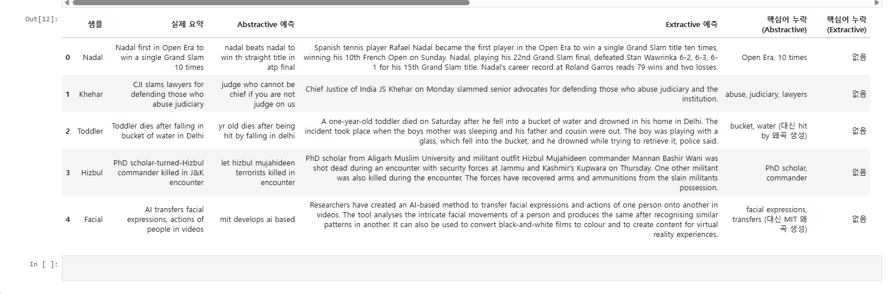
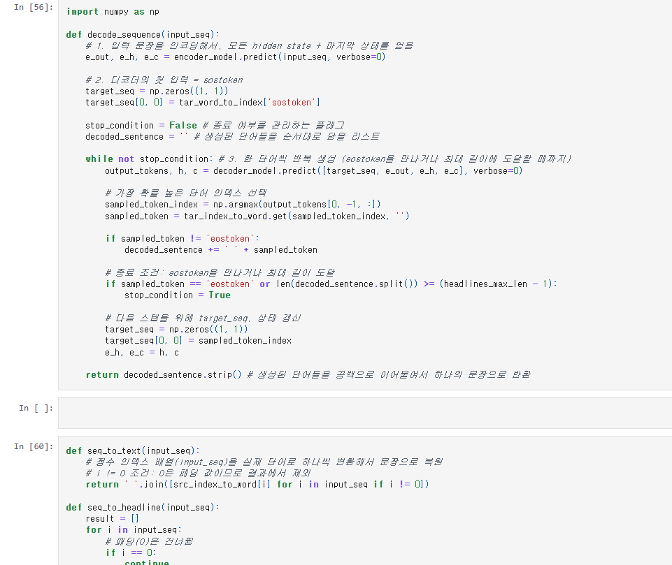
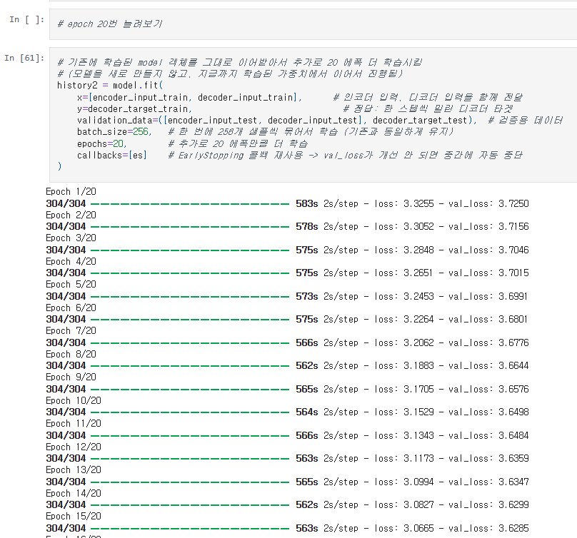
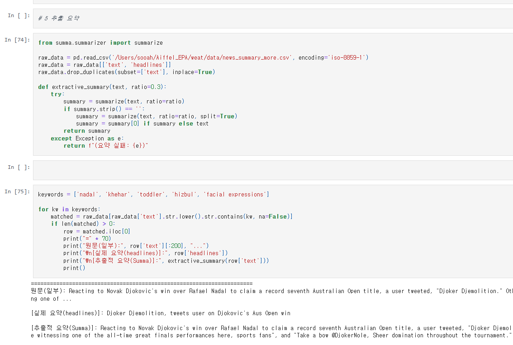

# AIFFEL Campus Online Code Peer Review Templete
- 코더 : 조수아
- 리뷰어 : 황인성


# PRT(Peer Review Template)
- [x]  **1. 주어진 문제를 해결하는 완성된 코드가 제출되었나요?**

        
    
- [x]  **2. 전체 코드에서 가장 핵심적이거나 가장 복잡하고 이해하기 어려운 부분에 작성된 
주석 또는 doc string을 보고 해당 코드가 잘 이해되었나요?**

          
        
- [x]  **3. 에러가 난 부분을 디버깅하여 문제를 해결한 기록을 남겼거나
새로운 시도 또는 추가 실험을 수행해봤나요?**

          
        
- [ ]  **4. 회고를 잘 작성했나요?**
    - 주어진 문제를 해결하는 완성된 코드 내지 프로젝트 결과물에 대해
    배운점과 아쉬운점, 느낀점 등이 기록되어 있는지 확인
    - 전체 코드 실행 플로우를 그래프로 그려서 이해를 돕고 있는지 확인
        - 중요! 잘 작성되었다고 생각되는 부분을 캡쳐해 근거로 첨부
        
- [x]  **5. 코드가 간결하고 효율적인가요?**

          


# 회고(참고 링크 및 코드 개선)
```
학습 시간이 오래걸려서 회고작성이 안된 모습을 보니 얼마나 힘들었는지 상상이 갑니다.
그럼에도 여러가지 시도를 하면서 해결을 해나가는 모습이 정말 좋았습니다.
```
